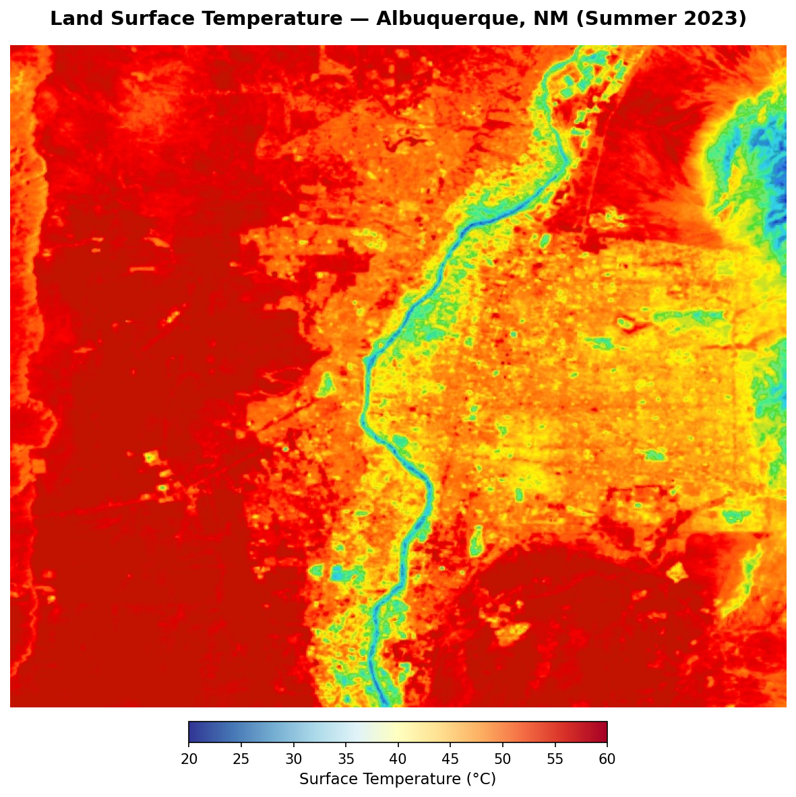
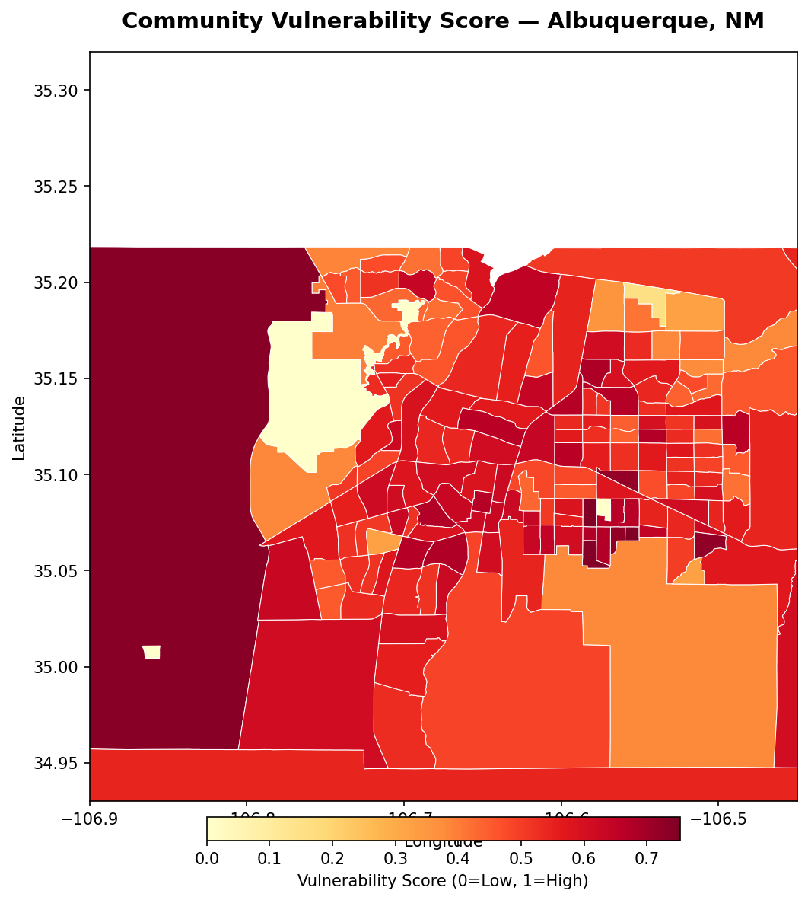
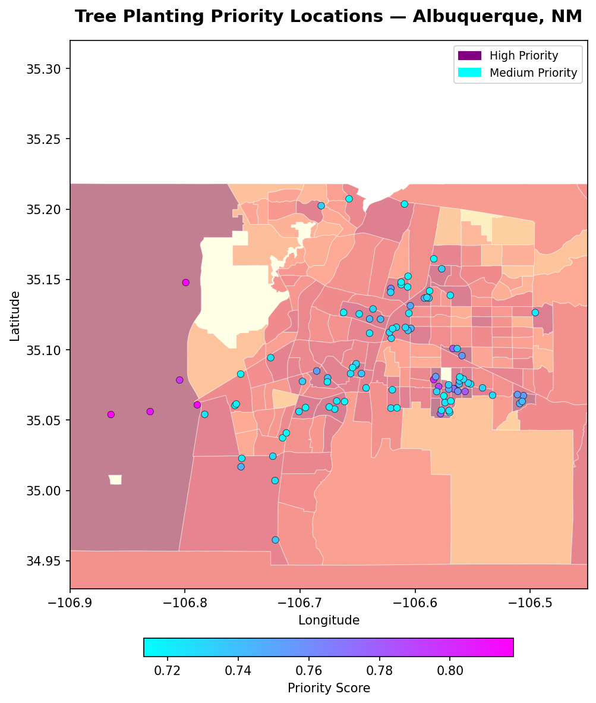

# UHI Mitigation Mapper

An AI-driven tool that identifies the highest-priority locations for tree planting and urban greening interventions to reduce Urban Heat Island (UHI) effects across cities in the Southwest United States.

---

## The Problem

Cities like Albuquerque, NM absorb and retain heat due to dark impervious surfaces — asphalt, rooftops, and concrete. This creates Urban Heat Islands where surface temperatures can exceed **50°C** in summer, directly causing heat stroke, especially in low-income and elderly communities with limited access to air conditioning.

**Average tree canopy cover in Albuquerque: ~9%** vs. national average of ~27%.

---

## What It Does

1. **Identifies heat hotspots** using Landsat 9 Land Surface Temperature (LST) data at 30m resolution
2. **Filters actionable zones** — removes water, existing trees, and highways to find places trees can actually be planted
3. **Overlays vulnerability data** from US Census to prioritize low-income and elderly communities
4. **Outputs a ranked priority map** showing where tree planting has the highest cooling ROI

---

## Results

### Land Surface Temperature Map

> Red/orange zones exceed 50°C surface temperature. These are the primary Urban Heat Island hotspots driven by asphalt and bare concrete.

---

### Community Vulnerability Score

> Darker red census tracts have lower median income, higher median age, and higher poverty rates — the communities most at risk from extreme heat.

---

### Tree Planting Priority Locations

> Each dot represents a high-priority planting location combining heat intensity and community vulnerability. Purple dots = highest priority. Planting trees here is estimated to drop ambient temperature by **2–4°C**.

---

## Sample Output

```
Rank   Latitude     Longitude     Heat    Vuln    Priority   Est. Drop
1      35.08423     -106.65231    0.923   0.871    0.893      3.7°C
2      35.07891     -106.66102    0.911   0.834    0.865      3.6°C
3      35.09102     -106.67834    0.898   0.812    0.847      3.6°C
...
```

Full ranked CSV exported to `data/outputs/priority_locations.csv`

---

## Project Structure

```
uhi-mitigation-mapper/
├── assets/
│   ├── heat_map.png
│   ├── vulnerability_map.png
│   └── priority_map.png
├── data/
│   ├── raw/          # Downloaded shapefiles
│   ├── processed/    # Vulnerability scores by census tract
│   └── outputs/      # Final maps and priority CSV
├── notebooks/        # Jupyter notebooks for exploration
├── src/
│   ├── data_fetch.py       # Google Earth Engine data + heat map
│   ├── heat_analysis.py    # LST + NDVI hotspot detection
│   ├── vulnerability.py    # Census data vulnerability scoring
│   ├── priority_index.py   # Final priority ranking
│   └── export_images.py    # Export static map images
├── requirements.txt
└── .gitignore
```

---

## Tech Stack

| Task | Tool |
|------|------|
| Satellite data | Google Earth Engine (Landsat 9) |
| Land cover classification | NLCD 2021 (USGS) |
| Data processing | Python, `geopandas`, `pandas` |
| Census data | US Census ACS 2022 API |
| Visualization | `folium`, `geemap`, `matplotlib` |

---

## Setup

```bash
git clone https://github.com/Adnan082/uhi-mitigation-mapper.git
cd uhi-mitigation-mapper
python -m venv venv
venv\Scripts\activate
pip install -r requirements.txt
```

Authenticate Google Earth Engine:

```python
import ee
ee.Authenticate()
ee.Initialize(project='your-project-id')
```

Run the full pipeline:

```bash
python src/data_fetch.py       # Step 1 — heat map
python src/heat_analysis.py    # Step 2 — hotspot detection
python src/vulnerability.py    # Step 3 — vulnerability scoring
python src/priority_index.py   # Step 4 — final priority map
```

---

## Data Sources

| Data | Source | Resolution |
|------|--------|------------|
| Land Surface Temperature | Landsat 9 (USGS) | 30m |
| Vegetation Index (NDVI) | Landsat 9 (USGS) | 30m |
| Land Cover Classification | NLCD 2021 (USGS) | 30m |
| Building Footprints | Microsoft Open Buildings | Vector |
| Socioeconomic Data | US Census ACS 2022 | Census Tract |
| Tract Boundaries | US Census TIGER 2022 | Vector |

---

## Target Region

Southwest United States — **Albuquerque, New Mexico**

Albuquerque was selected due to:
- One of the lowest tree canopy coverages of any major US city (~9%)
- Rapidly expanding impervious surfaces
- Large low-income and elderly population in South Valley neighborhood
- Active city tree planting initiative (Cool ABQ) that can directly use this output
